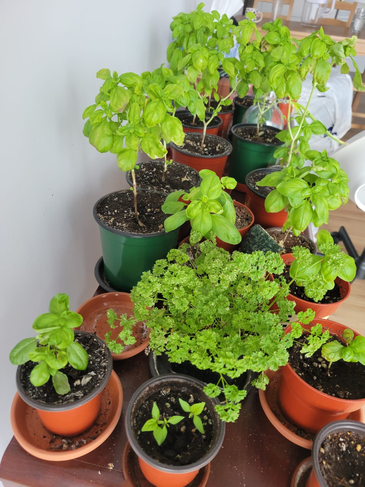
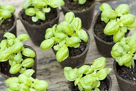
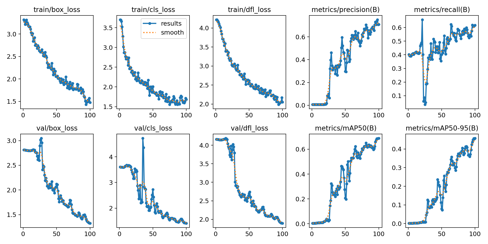

# Rapport de Projet
## 8INF804 - Vision artificielle et traitement des images
### Hiver 2025

# Détecteur de Basilic
*Système de détection de plantes de basilic à l'aide de YOLOv8*

## 1. Objectif de l'application

L'objectif principal de ce projet est de développer un système de détection d'objets multiples capable d'identifier et de localiser des plants de basilic dans des images et vidéos en temps réel. Plus précisément, ce système doit pouvoir :
- Reconnaître des plants de basilic dans différentes conditions (taille, angle, luminosité)
- Localiser précisément chaque plant de basilic à l'aide de boîtes englobantes
- Fonctionner en temps réel sur des vidéos
- Être assez robuste pour détecter le basilic indépendamment du contexte (pot, jardin, cuisine)

Ce projet s'inscrit dans le cadre de la première option proposée pour le travail final, à savoir : "travailler avec des vidéos et la détection d'objets multiples à l'aide d'un algorithme de type YOLO, RetinaNet ou encore DeepSort."

## 2. Intention/Motivation à développer l'application

Plusieurs facteurs ont motivé le développement d'un détecteur spécifique de plants de basilic :

### Intérêt pratique
- **Jardiniers et cultivateurs** : Un tel système pourrait aider à l'identification automatique des plants de basilic dans des jardins ou serres, particulièrement utile pour les systèmes d'agriculture automatisée ou de surveillance des cultures.
- **Application éducative** : L'outil pourrait servir à des fins pédagogiques pour enseigner la reconnaissance des plantes aromatiques.

### Intérêt académique
- **Défi technique** : La détection de plantes présente des défis intéressants en vision par ordinateur en raison de leur variabilité naturelle (taille, forme, couleur) et des différentes conditions dans lesquelles elles peuvent être photographiées.
- **Application des connaissances théoriques** : Ce projet permet d'appliquer concrètement les concepts étudiés dans le cours de traitement numérique des images, notamment les techniques de deep learning appliquées à la détection d'objets.

### Perspective d'extension
- Le développement d'un détecteur de basilic constitue une première étape vers un système plus complet de reconnaissance de diverses plantes aromatiques ou potagères, qui pourrait être intégré dans des applications mobiles ou des systèmes de jardinage intelligent.

## 3. Dataset choisi

Pour ce projet, un dataset personnalisé a été créé spécifiquement pour la détection de plants de basilic. Ce choix a été motivé par l'absence de datasets existants spécifiquement dédiés à cette plante.

### Composition du dataset
- **Source des images** : Mélange de photographies personnelles et d'images provenant d'internet:




- **Nombre d'images** : Environ 50 images contenant des plants de basilic
- **Variété de contextes** : Plants en pots, en jardin, en cuisine, etc.
- **Variété de conditions** : Différentes luminosités, angles, tailles et stades de croissance

### Préparation du dataset
1. **Collecte des images** : Prises de photos personnelles et recherche d'images libres de droits
2. **Annotation manuelle** : Chaque image a été annotée manuellement sur la plateforme CVAT (Computer Vision Annotation Tool) accessible via le site web app.cvat.ai


3. **Format d'annotation** : Création de boîtes englobantes (bounding boxes) autour de chaque plant de basilic, avec l'étiquette unique "basilic"
4. **Structure des données** : 
   - Organisation en dossiers (images/train, images/val)
   - Annotations au format YOLO (.txt) avec coordonnées normalisées
   - Fichier de configuration YAML définissant la structure et la classe

Les annotations au format YOLO contiennent pour chaque objet une ligne avec :
```
<class_id> <x_center> <y_center> <width> <height>
```
où toutes les coordonnées sont normalisées entre 0 et 1.

## 4. Méthodologie

La méthodologie adoptée pour ce projet suit une approche structurée en plusieurs étapes :

### 4.1. Définition du problème
- Identification précise de l'objectif : détecter des plants de basilic dans des images et vidéos
- Détermination des contraintes : fonctionnement en temps réel, robustesse aux variations

### 4.2. Collecte et préparation des données
- Acquisition d'images variées de plants de basilic
- Annotation manuelle à l'aide de CVAT
- Division du jeu de données en ensembles d'entraînement et de validation (même ensemble utilisé pour les deux dans ce cas, étant donné la taille limitée du dataset)

### 4.3. Choix de l'architecture
- Sélection de YOLOv8 comme architecture de base pour la détection d'objets
- Utilisation spécifique de YOLOv8n (version "nano"), offrant un bon compromis entre performance et rapidité d'exécution

### 4.4. Configuration de l'environnement
- Configuration d'un environnement de développement local
- Configuration d'un environnement Google Colab pour l'entraînement (accès GPU)
- Installation des dépendances nécessaires (ultralytics==8.3.127)

### 4.5. Entraînement du modèle
- Approche par transfert d'apprentissage (fine-tuning) à partir des poids pré-entraînés sur COCO
- Trois expérimentations différentes :
  1. **Test initial** : 1 epoch pour vérifier le bon fonctionnement du processus d'entraînement
  2. **Entraînement intermédiaire** : 20 epochs pour évaluation préliminaire
  3. **Entraînement complet** : 100 epochs pour obtenir un modèle optimisé

- Paramètres d'entraînement :
  - Taux d'apprentissage adaptatif
  - Optimiseur par défaut (SGD)
  - Augmentation de données intégrée à YOLOv8

### 4.6. Évaluation et ajustement
- Suivi des métriques clés pendant l'entraînement :
  - Box loss (perte sur les boîtes englobantes)
  - Classification loss (perte sur la classification)
  - mAP50 et mAP50-95 (mean Average Precision)
  - Precision et Recall
- Ajustement des hyperparamètres et de la durée d'entraînement en fonction des résultats

### 4.7. Test et validation
- Validation sur des images non utilisées pendant l'entraînement
- Test final sur deux vidéos personnelles stockées dans le dossier `videos` pour évaluer les performances en conditions réelles
- Analyse qualitative des résultats (précision des détections, faux positifs, faux négatifs)

## 5. Analyse des résultats

L'analyse des résultats de l'entraînement et des tests permet d'évaluer l'efficacité du détecteur de basilic développé.

### 5.1. Métriques d'entraînement

L'évolution des métriques au cours des 100 epochs d'entraînement révèle plusieurs tendances significatives :



#### Pertes (Losses)
- **Box Loss** : Diminution progressive de 3.32 à 1.47, indiquant une amélioration constante dans la précision de localisation des boîtes englobantes.
- **Classification Loss** : Réduction de 3.70 à 1.68, démontrant une meilleure capacité à identifier correctement les plants de basilic.
- **DFL Loss** (Distribution Focal Loss) : Diminution de 4.22 à 2.05, suggérant un affinement des prédictions de localisation.

#### Métriques de précision
- **mAP50** (mean Average Precision at IoU=0.5) : Augmentation significative de 0.004 à 0.688, montrant une amélioration substantielle de la performance globale.
- **mAP50-95** (mean Average Precision across IoU thresholds) : Progression de 0.001 à 0.457, indiquant une robustesse accrue face à différents seuils d'IoU.
- **Precision** : Amélioration de 0.006 à 0.71, reflétant une réduction des faux positifs.
- **Recall** : Augmentation de 0.40 à 0.617, montrant une meilleure capacité à détecter tous les plants de basilic présents.

Ces évolutions montrent clairement que le modèle a progressivement amélioré sa capacité à détecter et localiser précisément les plants de basilic. La stabilisation des métriques vers la fin de l'entraînement suggère que 100 epochs était une durée appropriée.

### 5.2. Tests sur vidéos

Les tests effectués sur deux vidéos (situées dans le dossier `videos`, dont "basilic2.mp4") non utilisées pendant l'entraînement ont permis d'évaluer les performances du modèle en conditions réelles :

#### Qualité des détections
- **Précision de localisation** : Les boîtes englobantes suivent correctement les contours des plants de basilic dans la majorité des cas.
- **Stabilité temporelle** : Les détections restent relativement stables d'une image à l'autre dans la séquence vidéo.
- **Adaptabilité aux changements** : Le modèle s'adapte correctement aux changements d'angle et de distance.

#### Limitations observées
- **Sensibilité aux conditions d'éclairage** : Quelques difficultés à maintenir des détections cohérentes lors de changements brusques de luminosité.
- **Confusion occasionnelle** : Certaines plantes similaires au basilic peuvent parfois être identifiées à tort comme du basilic.
- **Détections partielles** : Dans certains cas, seule une partie du plant de basilic est détectée, particulièrement quand les feuilles sont partiellement masquées.

### 5.3. Comparaison entre les différentes durées d'entraînement

La comparaison des résultats entre les trois expérimentations (1, 20 et 100 epochs) révèle l'importance d'un entraînement prolongé :

- **1 epoch** : Résultats très limités avec un mAP50 de seulement 0.004, essentiellement des détections aléatoires.
- **20 epochs** : Amélioration notable avec un mAP50 d'environ 0.023, mais encore insuffisant pour une application pratique.
- **100 epochs** : Performance significativement supérieure avec un mAP50 de 0.688, permettant des détections fiables en conditions réelles.

Cette progression souligne l'importance d'un entraînement suffisamment long pour permettre au modèle d'apprendre les caractéristiques distinctives des plants de basilic.

## 6. Travaux futurs pour améliorer la solution
Pour améliorer les performances du détecteur de basilic, plusieurs pistes peuvent être explorées :

### Enrichissement du dataset

- Augmenter le nombre et la diversité des images de basilic
- Inclure davantage de variations d'éclairage et de stades de croissance

### Optimisation technique

- Tester d'autres variantes de YOLOv8 (small, medium) pour améliorer la précision
- Optimiser les hyperparamètres d'entraînement
- Effectuer une quantisation du modèle pour le déploiement sur appareils mobiles

### Extensions fonctionnelles

- Développer une détection multi-classes pour plusieurs plantes aromatiques
- Ajouter la détection de l'état de santé des plants
- Créer une application mobile ou un système de surveillance automatisé

Ces améliorations transformeraient ce prototype en outil pratique pour le jardinage domestique ou l'agriculture de précision.

## Conclusion

Ce projet de détection de plants de basilic à l'aide de YOLOv8 démontre l'efficacité des techniques modernes de deep learning appliquées à la reconnaissance d'objets spécifiques. En partant d'un dataset personnalisé relativement modeste, nous avons pu entraîner un modèle capable de détecter avec une précision satisfaisante des plants de basilic dans des images et vidéos variées.

L'approche par transfert d'apprentissage s'est révélée particulièrement pertinente, permettant d'atteindre des performances acceptables malgré la taille limitée du jeu de données. Les résultats obtenus après 100 epochs d'entraînement montrent la capacité du modèle à généraliser ses apprentissages à de nouvelles images.

Les tests sur vidéos (stockées dans le dossier `videos`) confirment l'applicabilité pratique du système développé, tout en mettant en lumière certaines limitations qui pourront être adressées dans les travaux futurs. Ce projet constitue une base solide pour le développement d'applications plus avancées dans le domaine de la reconnaissance automatique de plantes.

## Références

1. Ultralytics YOLOv8 Documentation - https://docs.ultralytics.com/
2. Computer Vision Annotation Tool (CVAT) - https://www.cvat.ai/
3. Jocher, G., et al. (2023). Ultralytics YOLOv8. https://github.com/ultralytics/ultralytics